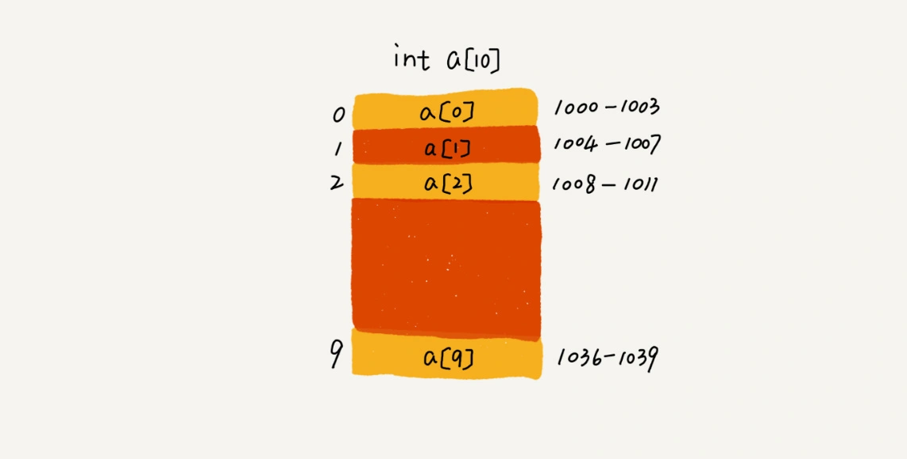

## 简介

数组是一个**线性表**类型的数据数据，它用一组**连续的内存空间**，来存储一组**类型相同的数据**。

数组中使用**下标**来表示某个元素在数组中的位置，下标从 0 开始计数。例如数组 array 中第 6 个元素，表示为：`array[5]`

## 读取

### 随机访问

基于**连续内存空间**和**类型相同**两个特征，使得**随机访问**数组中的数据成为可能。

假设数组 `array` 的起始内存地址为 `start`，因为储存的数据类型相同，因此每块数据占用的内存大小也相同，假设为 `size`，那么读取下标为 `i` 的数据的内存地址的公式为：`array[i] = start + i * size`

计算机可以通过这样的公式直接读取这个内存地址中储存的数据，不需要任何额外的操作，一发命中，所以其**时间复杂度为** $\mathbf{O(1)}$

### 访问越界

由于访问数组需要指定下标，那么当指定的下标不存在时，会发生读取错误，称为访问越界。这个错误在不同的语言中，有不同的表现。

如果是 Java 这种语言层做了越界检查的语言，就会抛出 `java.lang.ArrayIndexOutOfBoundsException`，但是如果是 C 语言的话，可能会发生不可预知的错误，比如无限循环。所以访问数组时，需要警惕访问越界错误。

### 查找

有些地方说数组适合查找，查找的时间复杂度是 $O(1)$，这其实是不对的。

随机读取的前提是知道元素的下标，**随机读取并不是查找**，查找是要在数组中找到某个目标元素，在找到之前是不知道下标的，所以**查找的时间复杂度不是** $\mathbf{O(1)}$。

查找有不同的实现算法，即便是排好序的数组，用二分法查找，时间复杂度也是 $O(log_n)$

## 插入

如果我们要在一个长度为 10，且前 5 个位置都已经有数据的数组中，插入一个新的元素到第 3 个位置，时间复杂度是多少？

例如现有数组 `[bily,tony,jack,oliver,james]`，我们要将新同学 `harry` 插入到 `jack` 现在的位置上，这里需要分两种情况来看

### 有序插入

如果插入之后需要保持元素的顺序，插入后的数组应该是这样 `[bily,tony,harry,jack,oliver,james]`，那么第 3 位及以后的所有元素都需要往后挪一位。

这种情况下，最好时间复杂度是 $O(1)$，就是插入的元素刚好在最后一位的情况，不需要移动任何元素；

最坏时间复杂度是 $O(n)$，就是插入的元素在第一位的情况，所有元素都需要移动一次；

那么平均时间复杂度是多少呢？因为插入到每个位置的概率都是一样的，所以**平均时间复杂度是** $\frac{1+2+\cdots+n}{n}=\mathbf{O(n)}$

### 无顺插入

如果插入之后不需要保持元素的顺序，那么插入时直接交换 `jack` 和 `harry` 的位置即可：`[bily,tony,harry,oliver,james,jack]`

此时无论将新元素插入到哪个位置上，都只需要操作新旧两个元素，因此**时间复杂度是** $\mathbf{O(1)}$

### 扩容

因为数组使用的是一块连续的内存，所以在使用之前就需要提前向计算机申请内存，也就是在声明数组时，需要确定数组的大小。

当数组中的空间耗尽时，就无法插入新元素，此时需要手动给数组进行“扩容”，也就是新申请一个更大的数组，然后将原来的数据搬过去，再插入新数据。这是一个比较耗时的操作，**时间复杂度是** $\mathbf{O(n)}$

## 删除

### 立即删除

还是因为数组使用连续内存空间的特征，所以在删除了其中一个元素后，这个位置不能空着，否则内存空间就不连续了，那么就需要把后面的数据都往前挪一位。

这个操作和保持顺序插入是比较类似的，如果删除的刚好是最后一个元素，那时间复杂度就是 $O(n)$，如果删除的是第一个元素，那时间复杂度就是 $O(n)$，而平**均时间复杂度是** $\mathbf{O(n)}$

### 延后删除

除了踏踏实实的立即删除外，为了优化数组删除操作的性能，工程师们有一些巧思妙想。

例如，我们要在数组 `[bily,tony,harry,jack,oliver,james]` 中依次删除 `bily` 和`tony`，如果操作一次就删除一次，那么就会造成两次数据搬运，造成性能损耗。

实际上，在大部分情况下，删除就是为了让被删除的数据无法被读取，那么我们只需要将这两个数据标记为已删除，而不是真正的删除，让其无法被读取，然后等到数据空间不够的时候，再一次性删除所有被标记为已删除的数据，只需要进行一次数据搬运操作。

在操作频繁的情况下中，这样可以大大提高数组操作的性能表现。

这个先标记再延迟删除的思路，其实就是 Java 虚拟机中标记清除垃圾回收算法的核心思想。数据结构和算法的魅力就在于此，**很多时候我们并不是要去死记硬背某个数据结构或者算法，而是要学习它背后的思想和处理技巧，这些东西才是可拓展可迁移，才是最有价值的。**

## 总结

- 数组是一种适合多读少写的数据结构，随机访问效率很高，时间复杂度是 $O(1)$，但是插入和删除操作相对低效，时间复杂度是 $O(n)$
- 数据本身是一种很基础的数据结构，提供的 API 比较有限，复杂操作并不方便。很多编程语言都提供了以数组为基础的容器，提供了更多的 API，使用起来更加方便，如果不是对性能有非常高的要求，日常开发中使用容器更方便。
- 基于数组本身的特点，在使用数据容器（例如 Java 中的 ArrayList）时，尽量提前设置大小，可以提高效率。