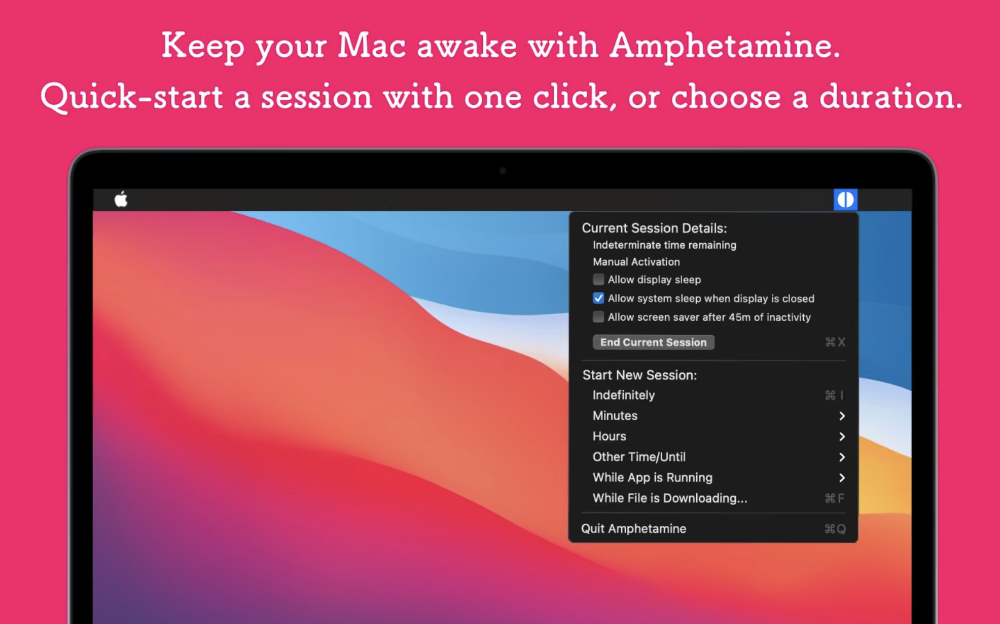
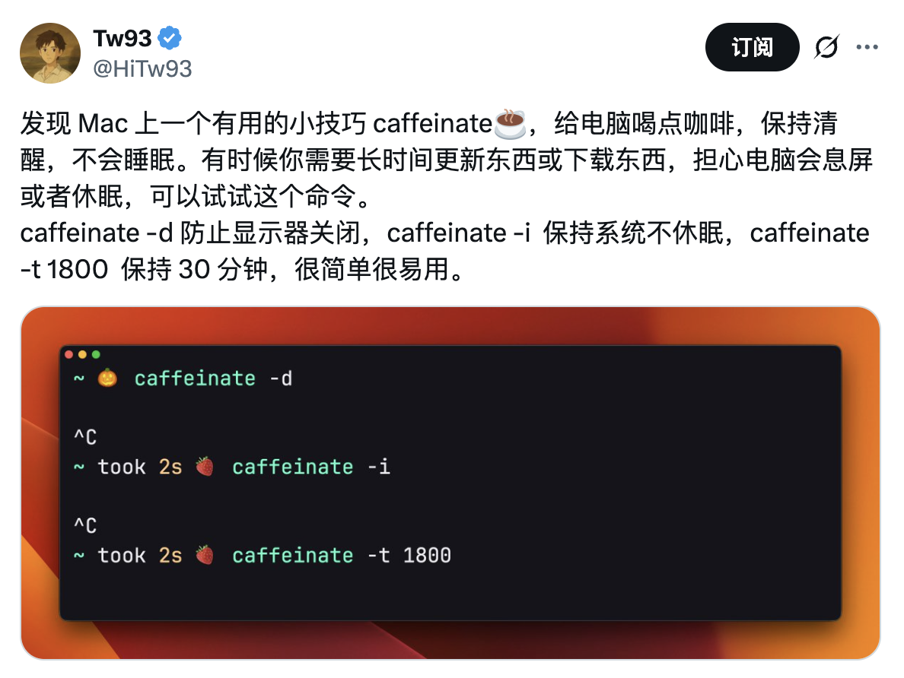
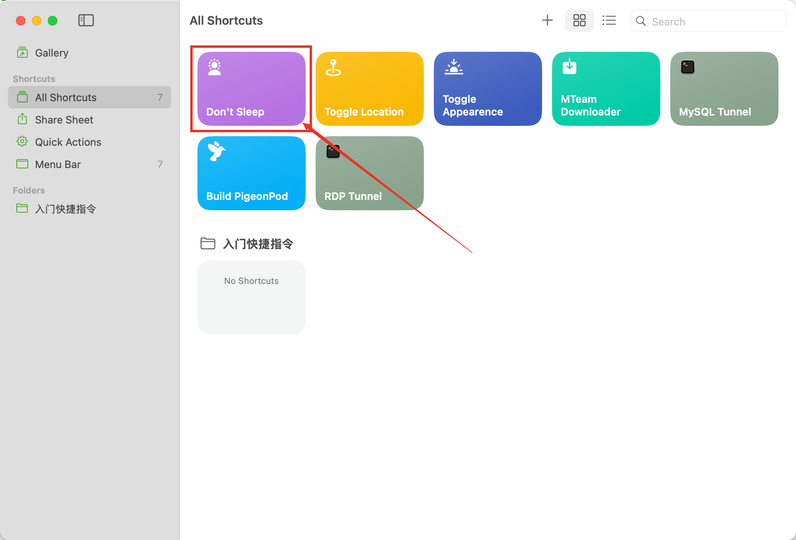
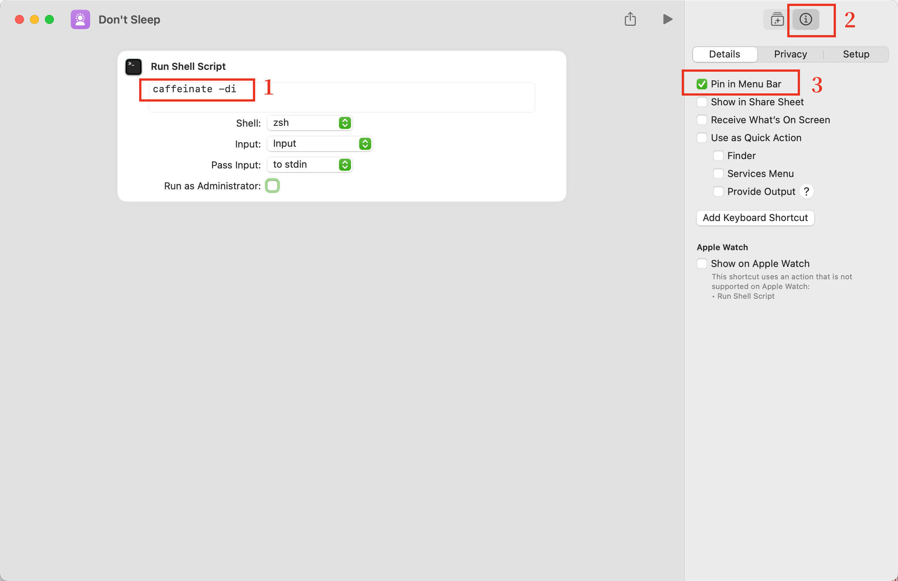
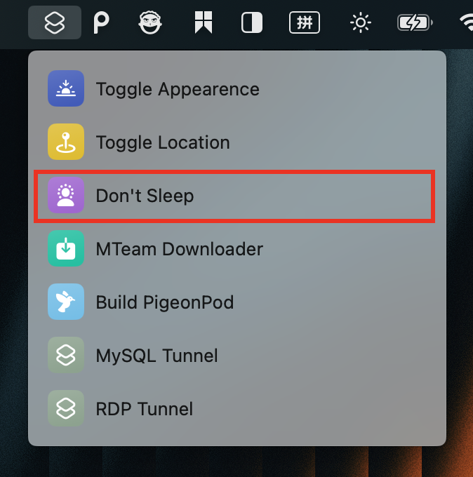
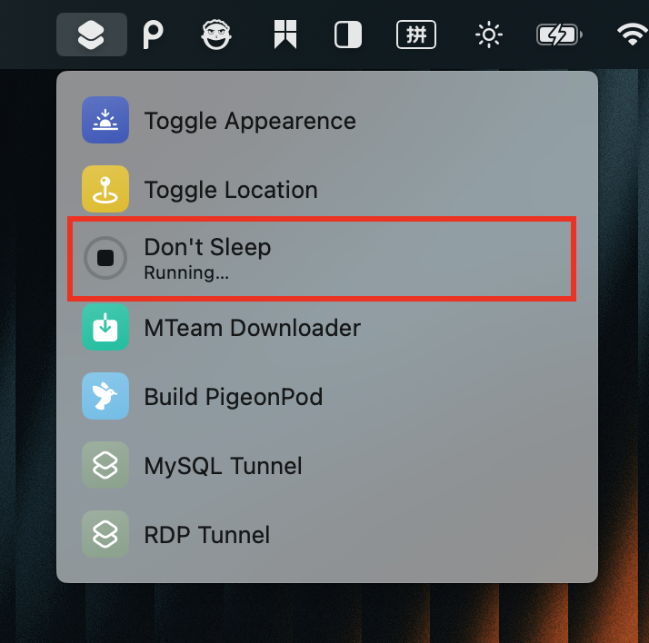

Cursor、Codex、Claude Code、Gemini CLI 之类的 AI 编码助手越来越好用，执行复杂任务的表现越来越好，有时候进行比较复杂的项目规划和代码编写时需要让 Mac 不休眠，防止 AI 任务运行中断。

之前一直在用一款免费的软件叫 [Amphetamine](https://apps.apple.com/us/app/amphetamine/id937984704).

这个小软件很好用，需要的时候启动，设置一个不休眠持续时间，就可以了。用了一段时间后，我发现我从来没设置过其他时间，永远都是打开后将不休眠时间设置为 “无限”，然后在一段或者一天的工作结束后，手动关闭。

其几天在 [@HiTw93 的推文中](https://x.com/HiTw93/status/1967371534248316961) 发现原来 Macos 上有一个自带的命令行小工具叫 `caffeinate`，直接在命令行里执行 `caffeinate -d` 阻止屏幕关闭，`caffeinate -i` 阻止系统睡眠。

这完全完全可以满足我对 Amphetamine 所有需求，但是命令行用起来还是不够方便，所以我用 Shortcut 做了个快捷指令：`Don't Sleep`

根据下面截图的步骤来，新建一个快捷指令，然后把这个快捷指令放到 Menu Bar 上，就是一个非常好的 `一键开关休眠` 的小工具了！

1. 创建一个快捷指令叫 Don't Sleep

2. 在里面运行 Shell Script，并且勾选 Pin in Menu Bar

菜单栏效果 

需要 Mac 不休眠的时候点一下，再也不用担心 AI 员工睡着了！

