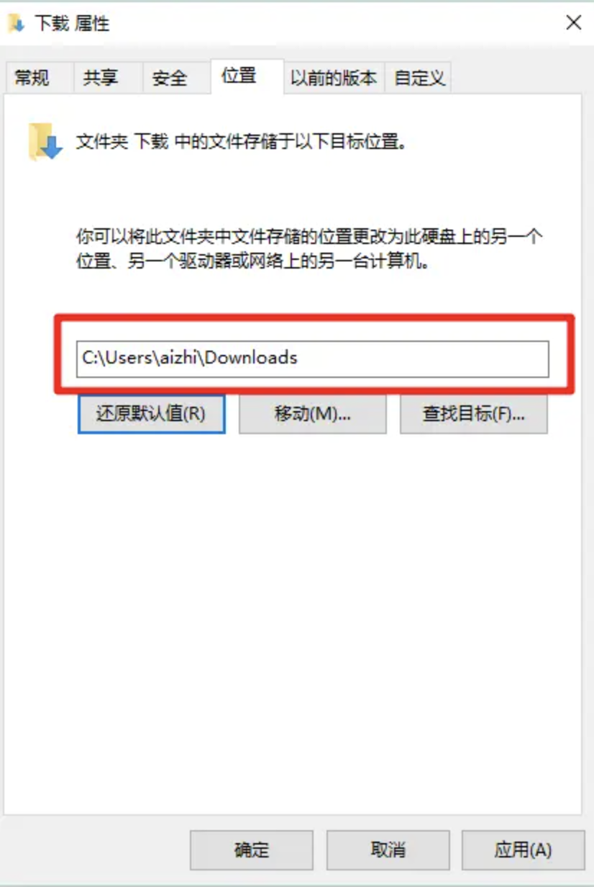
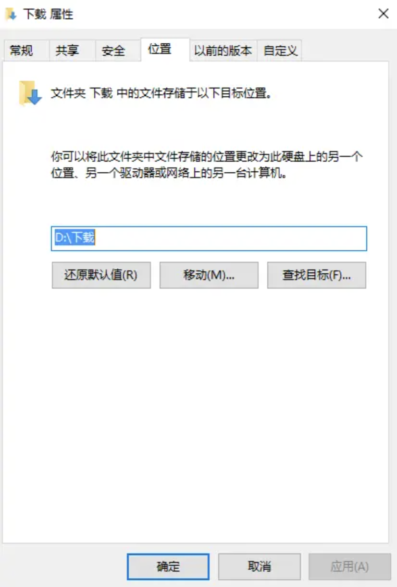
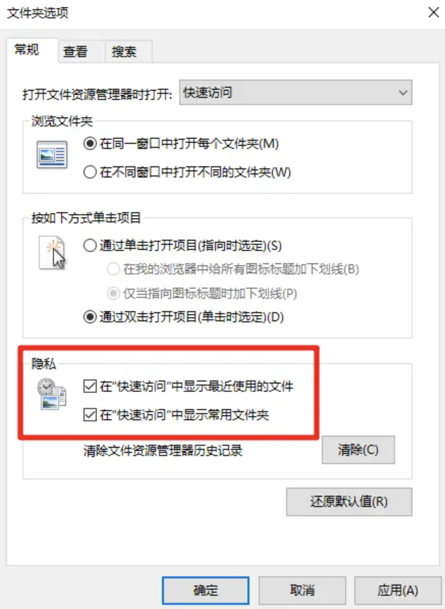
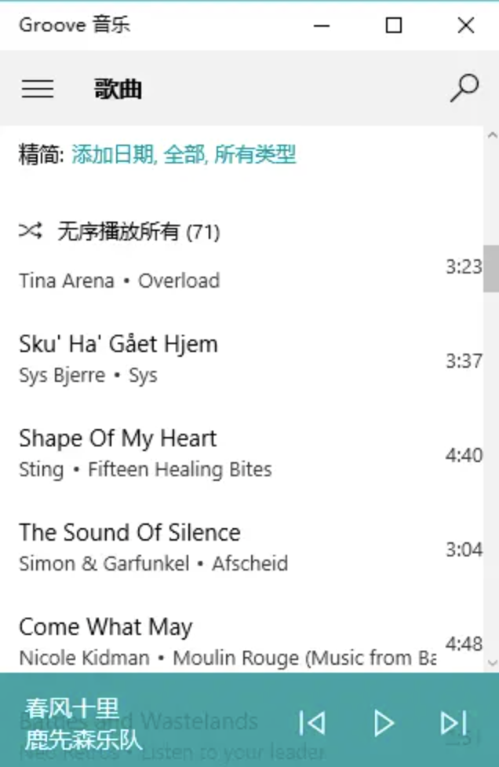
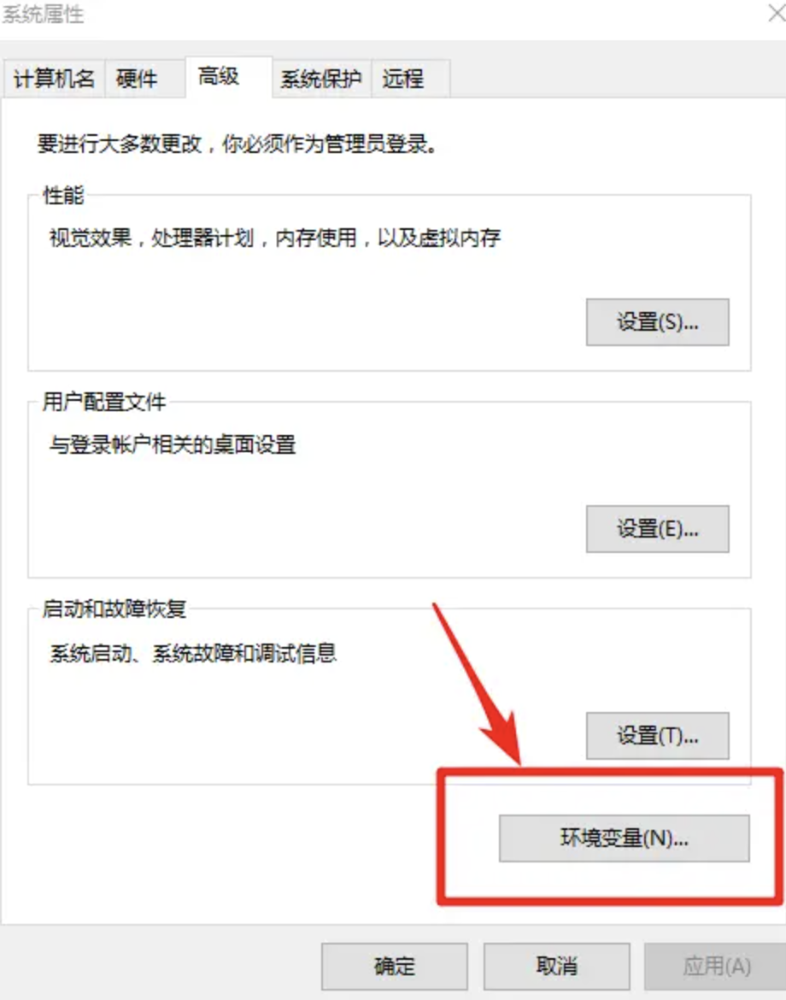
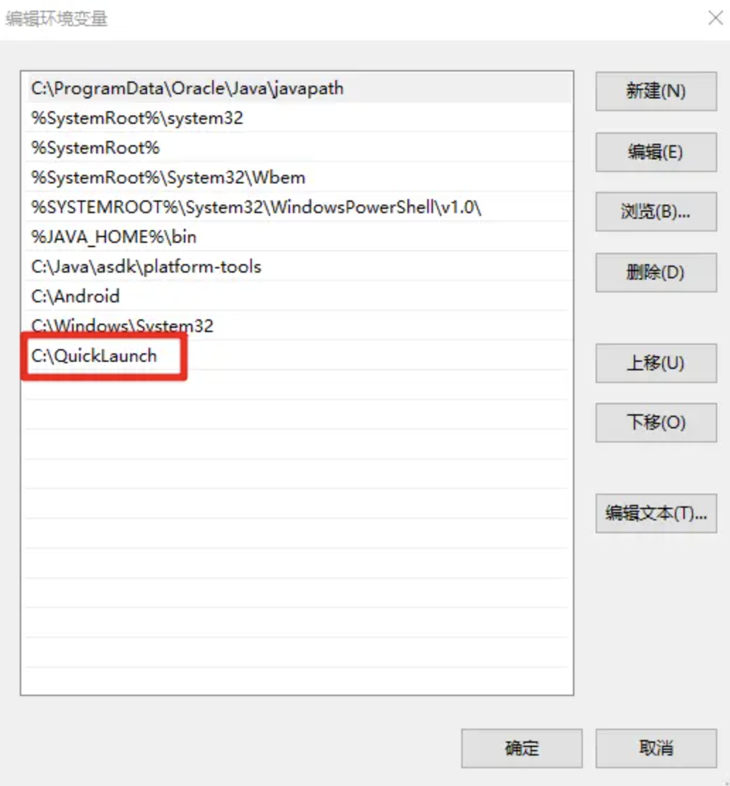

> 本文撰写于多年前，可能有些链接已经失效，请见谅。

# 前言：

- 由于经常要帮各种同学朋友处理电脑的各种问题，于是经常会产生下面这样的对话：

  **同学：大神，这些文件夹都是什么东西？**
  **我：这是你的电脑，你自己电脑上的东西你自己不知道？**
  **同学：我不知道啊！我都不知道这些东西是哪儿来的啊！**
  **我：冷漠脸.jpg**

- 还有被一些神问题追问了N年：**大神，为什么我电脑这么卡啊？！为什么我电脑总是莫名其妙多出一些乱七八糟的软件呀？为什么我桌面这么多广告啊？**

- 然后很多朋友看到我用自己电脑的时候都会投来羡慕的目光，并抛出这样一连串的问号：**你的系统看起来好简洁好漂亮啊，快捷方式都没有，怎么打开软件啊？为什么这么流畅，看起来一点都不卡？这笔记本配置一定很高吧？一定很贵吧？** 但是其实我的电脑真的只是个普通得不能再普通的笔记本而已，配置不高，价格不贵。

**虽然不是大神，但是作为一个耿直boy，我毅然决定耗尽我二十年的功力写下这篇文章，希望能对大家有所帮助。**

***
**Talk is Cheap，Let`s do it !**
***

> ps：由于此篇文章是面向所有windows用户的，尤其是小白用户，所以一些专业软件，比如开发人员用的集成开发环境、财务人员用的财务汇算软件、工程师用的3D建模软件、设计师、剪辑师用的Adobe系列软件等等都不会涉及，只会涉及一些通用的方法及大家都要用到的常用软件。

**Tips：文章很长，是因为写得很详实，每一步都写得很清楚，所以大家看到长文不要怕，长说明好懂易操作，跟着我写得步骤来就行 了。然后建议大家看每一个章节之前先看看标题，并不是每个人都需要看完所有章节，按需求看对应的章节即可。一次看不完可以收藏着慢慢看。**

## 1. 新系统上手篇

### 对于新买的笔记本：

#### 1. 卸载预装软件

新买的笔记本一般都是预装了正版windows系统的，这个windows我们也是付了费的，当然不能随随便便就格掉然后去装个盗版系统。但是现在预装的windows里面一般都还会有一些产商好心给我们预装的软件，比如Acer的笔记本里一般会预装Acer自己的文字、表格处理软件以求一定程度上代替microsoft的office软件，避免我们购买office软件时的花费，但是实际上效果并不好，还有各大品牌笔记本一般会预装各自的备份软件，但是实际上这些软件对普通用户来说基本上都没什么作用。那么我们**第一件事就是打开控制面板（找不到控制面板的同学请自行百度）将自己用不上的预装软件全部卸载。**

##### 2. 补全驱动

一般来说新买的笔记本驱动都是完全装好了的，但是也不排除有部分驱动没有安装的情况。所以我们还是需要检查一下自己电脑的驱动是否安装完全。**打开“设备管理器”检查驱动是否有问题，如果有黄色小感叹号则说明有驱动未安装，如果没有感叹号则说明无需安装驱动。**

**如果需要安装驱动的话：**

1. **推荐去官网下载对应的驱动，然后安装即可。**
2. 使用驱动软件安装，比如鲁大师、驱动精灵、驱动人生等软件。**驱动装完后立即卸载！驱动装完后立即卸载！驱动装完后立即卸载！**不要听他自己吹得花里胡哨的，这类软件就应该老老实实的做一个单纯的驱动安装器，装完驱动后还留在电脑上没有任何好处！
    
    由于国内软件市场的特殊原因，导致目前软件安装的时候乱象丛生，所以作为一个耿直boy，我一定要提醒大家：
    **安装任何一款软件的时候一定要注意取消捆绑安装包，否则会给你安装一些乱七八糟并不是你想要的东西。**  
    比如下面这样的：
    
    

**卸载的时候同样也要小心，有一些软件在卸载的时候还会捆绑安装包。**

### 对于新买或者新组装的台式机或者预装Linux的笔记本：
#### 1. 安装好系统
考虑到对于自己能组装PC的boys来说，装系统简直是小菜一碟；对于不会装系统却买了组装PC的妹纸们来说，身后一定有一个和蔼可亲的电脑城装机老板，或者一个像我一样默默奉献的耿直boy，所以装系统不在本篇文章的讨论范围之内。

**但是作为一个有理想、有道德、有文化、有纪律的耿直boy，我还是要善意的提醒一下：尽量不要装GHOST系统，以避免后续很多不必要的麻烦。**

推荐一个我最喜欢的下载Microsoft系统及软件的网站[MSDN我告诉你](http://www.itellyou.cn/)，这里的系统都是和微软官方发售的一样。

>ps:这个网站的站长免费维持了这个网站9年时间，坚持做到了不收费、无广告、无病毒，非常敬佩以及感谢站长。维持一个网站也是需要成本的，前一段时间网站由于续费问题停了一段时间，现在又重开，并开启了捐助，作为一个耿直boy，我第一时间用实际行动表达了自己对站长的感谢，也希望有能力的朋友能略尽绵薄之力，为混乱的国内互联网环境点亮一盏明灯。

至于激活问题，对于能装机的boys来说更加不是问题了。

#### 2. 装好驱动

这个方法同上，就不啰嗦了。

***

## 2. 基本系统优化篇

总所周知，从win7开始，windows资源管理器就企图用“库”的概念取代传统的“我的电脑”，实际上是一个很大的进步，但是由于众多的原因，尤其是大量XP用户的使用习惯问题，这个概念并没有被普及开来，虽然这个功能从win7一直延续到win10，但是使用者寥寥无几。深入理解“库”相对来说其实是一项并不容易的事情，我也没有这么大的能耐，在这里几句话教会大家如何正确高效使用“库”，但是我们可以退而求其次，教大家怎样高效而正确的使用win10的“快速访问”功能。

### 1. 更改文件夹的默认位置

大家会发现从win8（或是win7）开始，打开我的电脑时除了会显示你的几个磁盘以外，还会再上面显示视频、图片、文档、音乐、下载、桌面这6个文件夹，像这样：

很多人觉得上面那几个文件夹很鸡肋，因为这些文件夹的默认储存位置都在C盘目录下，而这几个文件夹几乎囊括了我们计算机中绝大部分的文件，一旦我们把文件放在这里面，C盘吃枣有一天要“爆炸”！

其实这种想法只对了一半，因为windows在设计的时候并没有想到我们会把一个磁盘分这么多区，C盘只有这么点小。那不管怎么样吧，既然我们C盘确实是不能放这么多东西的，那怎么办呢？

**其实这些文件夹的默认位置都是可以改的嘛！**

以下载为例，具体操作为：右键需要更改默认路径的文件夹—属性—位置，看到那个“C:\Users\你的用户名\Downloads”路径了吗，那个就是默认路径，如图：

在你真正想要储存下载文件的地方新建一个文件夹，比如我在D盘新建了一个文件夹“下载”。

然后我们点击那个移动，选择我们D盘下的“下载”文件夹，点击应用。Boom！这样就改好了！如图：

这样把那几个文件夹路径改好以后，大家就可以放心大胆的把视频、图片、音乐、下载等文件存到对应的文件夹了，再也不用担心C盘会Boom啦~~  这样还有一个好处就是你会发现很多软件默认读取的文件路径都是可以直接对口的，比如某一个软件需要读取图片文件，他就会默认去你的图片文件夹读取，而不会需要手动改来改去了。

### 2. 正确、优雅的使用“快速访问”

**首先教大家一个非常实用的快捷键：在任意状态下按windows+E，都可以快速打开“快速访问”。**

那么问题来了，快速访问界面上会有很多我们并不像看到的问价和文件夹，像这样：

或许你的界面会更多乱七八糟的东西，那么如果你像我一样不想让这些东西扰乱你的视线，怎么办呢？

**隐藏它们就可以了！**

点击文件资源管理器的额头上的那个“查看”，然后点击右边的“选项”，如图：

然后将“常规”选项卡中的画红框框的地方的勾去掉，一看就知道是什么意思，如图：

Boom!这样设置以后，我们就不会在快速访问中看到你最近使用的文件列表了，快速访问页面也就清爽了很多。**但是这还不够，如果我们常用的文件夹除了默认的那六个，还有其他的怎么办呢？**，继续往下看：

我们随便右键点击你常用的某个文件夹，单击“固定到快速访问”选项即可，Booom！如图：

这样我们就能自定义添加我们需要的文件夹到快速访问页面了。

**经过这样一番改造我们就能在我们需要打开某个文件夹或者找某个文件的时候，直接按下Windows+D就能打开我们的快速访问页面，而呈现在我们面前的就是我们最常用的那些文件夹，再也不用点来点去，要用找不着了(´,,•ω•,,‘)**

***

## 3. 常用软件篇

**Tips：**

- 首先还是要强调上面说到的那一点，**安装和卸载软件时千万千万要注意取消绑定的安装包，免得发生“装一送N”的人间惨剧**，详情请看第一章第一节第二点。

- **下载软件尽量去官网下载安装包，请尽量不用或者少用破解软件，大部分收费软件的部分功能都有其他免费软件可以代替。** 国内几大破解软件聚集地如：太平洋下载站、ZOL软件下载、军华软件园、非凡软件站、西西软件园等等这些地方，资源确实很丰富，但是使用体验极差，充斥着各种广告和假链，小白用户极易中招，这都是我身边朋友血和泪的教训。

- **在下载软件的时候，如果有“高速下载”和“普通下载”，请点击“普通下载”，根据个人经验，“高速下载”下下来的基本都是安装器或者管家类软件而不是安装包。况且真正的下载速度更多的是取决于你的带宽大小，而不是这个按钮，请不要被一个按钮蒙蔽双眼。**

- 对于没有了360管家或者腾讯管家就不知道去哪儿下载软件的小白用户来说，你想下载什么软件，直接去百度（有条件的请使用Google）搜索这个软件的名字，找到这个软件的官网，官网会有对应的下载包，把它下载下来，双击这个exe文件（exe是一种可执行文件，一般作为软件安装包存在，类似于android手机的apk文件）即可安装。

- **安装软件请不要随意更改默认安装路径！安装软件请不要随意更改默认安装路径！安装软件请不要随意更改默认安装路径！** “软件最好不要安装在C盘”，这种说法和习惯已经是上古时代的产物了，请不要停止进化，让我带你一起跟上时代的脚步，踏上社会主义的康庄大道(ง •̀_•́)。具体参考看我很久以前专门为这个问题写的另一篇文章：[软件真的不能安装在C盘？幼稚！](http://www.jianshu.com/p/36adc3e0a617)

- **不要装任何电脑管家类的软件！不要装任何电脑管家类的软件！不要装任何电脑管家类的软件！包括但不仅限于360管家、百度管家、腾讯电脑管家、金山电脑管家等等**，我实在看不出这类软件的价值，清理垃圾后面我会推荐更加专业、安全良心的软件，安装软件推荐去官网下载安装。相反很多人电脑变卡、死机甚至蓝屏，都有这类管家类软件的功劳。**并且这类软件最让人诟病的就是我们所说的“全家桶”效应：你装上了360管家（或者其他管家），它会想尽各种办法让你装上360家族的所有能装的软件，不达目的誓不罢休。

- **而许多人民热衷的“开机速度大比拼”游戏简直是让人无语，作为一个耿直boy，这里我还是简单科普一下windows关机、睡眠和休眠的区别和正确使用方法的说明。**

> **关机：** 退出并关闭所有的软件和服务，关闭电源。下次开机时所有的软件和服务都需要重新启动才能运行。
**休眠：** 所有的软件和服务都不退出不关闭，而是直接处于冻结状态，并将应用数据保存的硬盘当中，关闭电源。下次开机时所有上次冻结的软件将直接解冻并直接可以运行，不用重新打开，看电影的能接着看，写文章的也能直接接着写。
**睡眠：** 类似于休眠，将所有软件冻结，但是将数据保存的内存当中，而不是硬盘中，由于内存中的数据断电会丢失，所以睡眠是不会关闭电源的，睡眠会将电脑不用的部分如cpu、硬盘、网卡等部件断电，保持内存通电，下次使用电脑时电脑能以非常快的速度立刻从睡眠中唤醒，并保持你睡眠前的状态。也不用担心内存寿命问题，正常使用情况下质量好的内存的使用寿命远远超出电脑中其他任何关键部件的寿命，几乎是长生不死，直到淘汰。也不用过分担心功耗的问题，睡眠时的功耗通常只有几瓦，非常低。
**所以结论就是：平时有事出门、睡觉什么的要离开电脑，睡眠就可以了，下次使用时3秒钟就能恢复至工作状态。用360再怎么优化开机速度也赶不上吧？要出远门或者几天不使用电脑，休眠就可以了，休眠和关机是一样的，0功耗。至于关机，那就看你心情了，我都几个月没关过机了，偶尔觉得有点慢了，重启一下即可。**

- **360系列软件、百度系列软件能不用尽量别用**，不是黑，是因为它真的强制或半强制或以极其隐蔽的手段的把他们家的兄弟姐妹全都弄到你们家来住着，美其名曰为您服务，但是我们家只有100平啊，哪能容得下十几个保姆啊！而且如果你装了两个家族不同的软件，他们还会在暗地里互相掐架，你的电脑活生生就变成了战场。防不胜防。**所以最好一个都不要碰！** 不信我说的或者有兴趣看它们互相掐架的乡亲们可以看看B站的这位勇士的亲身实践：[实战百度全家桶桶VS360全家桶](http://www.bilibili.com/video/av2943015/)，非常有趣。但是作为一个耿直boy，我还是要提醒一下大家：场面极其凶残，胆小勿入。

- 然后推荐两个软件分享网站[异次元软件世界](www.iplaysoft.com)和[小众软件](www.appinn.com)，我几乎所有好用的软件都是在上面淘来的，除了软件推荐有时候还会有一些科普文，也相当不错。**力荐！**

- 下面所有绿色的文字都是带有链接的，点击即可进入对应的官网或者下载地址。由于一些是国外软件，所以官网都都是国外站点，打开时可能有点慢，还请耐心一点儿。

***

下面就开始正式推荐软件了

***

### 1. 视频播放器：

#### 1. 首推[MPC-BE](https://sourceforge.net/projects/mpcbe)

这是老牌知名开源轻量级播放器MPC-HC（全称Media Player Classic Home Cinema）的一个俄罗斯分支版本，不得不说战斗民族确实厉害，个人感觉这个版本比原始的MPC-HC要更加强大，更加好用。也是我的默认播放器，我电脑里所有的音视频文件都是用它播放，目前还没有发现不能播放的。**开源免费，无广告无后门，简单强大！**

#### 2. 第二个就是MPC-BE的老本家[MPC-HC](https://mpc-hc.org)

上面已经说过了，这是一款老牌开源免费播放器，在播放器界名声显赫，自是不必多说的好。**开源免费，无广告无后门，简单强大！**

#### 3. 还有一个同样久负盛名的开源播放器[VLC](http://www.videolan.org/)

同样是一款大名鼎鼎的播放器，全平台制霸，不必多言。**开源免费，无广告无后门，简单强大！**

#### 4. 还有众多视频发烧友的最爱[PotPlayer](http://potplayer.daum.net/?lang=zh_CN)

这是一款来自韩国的播放器，同样十分强大，但是它最大的特点是自定义程度相当高，很多插件和皮肤供你选择和下载。软件不开源，但是同样免费和清爽，其实不是很推荐小白用户使用，可玩性太高的东西都有一个共同的特征，就是对入门者来说都不是太友好。但是还是非常值得一试的。

#### 5. 不推荐任何在线视频服务站的客户端

包括但不仅限于优酷客户端、爱奇艺客户端、PPS客户端、迅雷看看视频播放器。因为这些播放器往往是广告泛滥的重灾区，广告多到已经让我无法忍受，各种自启动，各种后台强制驻留，各种卡。。。画质又差，国内视频网站宣传的高清、超清画质我已经无力吐槽了。

能用浏览器看的为什么要下客户端呢？

真想好好看电影看电视的还是推荐下载下来再看吧，没广告、不会卡，这才是该有的体验。

### 2.音频播放器：

#### 1. 还是首推[MPC-BE](https://sourceforge.net/projects/mpcbe)和[MPC-HC](https://mpc-hc.org)

其实对于像我这样的非音频发烧友来说，只需要一款支持格式广泛的本地播放器能满足偶尔播放一下各种稀奇古怪的音频文件的需求就足够了。这两款播放器是音视频通吃型，启动速度快，占用资源小。不用再偶尔播放一个音频文件还要慢吞吞的打开酷狗音乐、QQ音乐什么的了。

#### 2. [Foobar2000](http://www.foobar2000.org/)

对于音频发烧友，当然是首推神器[Foobar2000](http://www.foobar2000.org/)，但是这款神器并不适合所有人，尤其是普通用户，过于强大和可定制化，对新手来说相当不友好，我自己也不太会用Foobar，所以就不在这里班门弄斧了。

#### 3. 网易云音乐（UWP版）

还不知道什么是UWP软件的父老乡亲们可以看看这里：[啥是UWP应用？](http://baike.baidu.com/link?url=em9wzpxapvWIaIvVMZXLY2fbdms7CMKeRArnb2RS6BL9h1c-Ma2BVjkODO7G3br2OftILg125drCvdvqc1Aj5a)

在线音乐播放器其实选择很多，QQ音乐、酷狗音乐、酷我音乐等等，各位父老乡亲就自行选择吧，但我偏爱新晋“网红”[网易云音乐](http://music.163.com/)，其歌曲推荐和评论都是深得我心的亮点。但是WUP应用启动速度快，界面清爽，占用资源少这些亮点成为了我推荐网易云音乐UWP版的理由。**以上音乐播放器有uwp版的推荐优先选择uwp版应用**

#### 4. win10自带的Groove音乐

这款本地音乐播放器可以说在win10上存在感极低。。。但是这并不妨碍它成为一个好用的本地音乐播放器。如果你会在电脑里囤一些mp3文件，那么这款播放器应该是一款不错的本地播放器，启动速度极快，界面很清爽很漂亮，至于音质嘛，这个我真不懂。。。

### 3. 浏览器

#### 1. 首推Chrome浏览器

由于众（gai)所(si)周(de)知(qiang)的原因，chrome浏览器的官网在中国无法正常访问，所以下载这个软件推荐去百度软件中心下载，[点击这里直接进入下载页](http://rj.baidu.com/soft/detail/14744.html?ald)。同样，请点击普通下载。

#### 2. 其次是[Firefox火狐浏览器](http://www.firefox.com.cn/#desktop)

由于chrome浏览器在国内无法正常登陆google账户，也无法正常获取插件，而火狐浏览器却可以登陆账号同步数据和正常获取插件，所以推荐所有无法正常访问Google的父老乡亲使用这款浏览器。

#### 3. 其实IE11和win10上的Edge浏览器并没有那么糟糕

有时候需要使用IE内核的浏览器（比如网银系统还是只支持IE内核）时用来顶一下也是可以的。

### 4. 压缩解压软件

#### [Bandizip](http://www.bandisoft.com/bandizip/cn/)

这里只推荐一款压缩解压软件：[Bandizip](http://www.bandisoft.com/bandizip/cn/)

**可能是最好用的免费压缩解压软件** 

支格式适众多，压缩算法也比较先进，速度很快，支持预览，关键是完全免费，而且没有任何广告，强烈推荐。

可能大家不知道，以前很多装机商给我们预装的WinRAR其实是个商业收费软件，装机商大量预装盗版软件给他们也带来了不少的麻烦，虽然该团队现在已经放出了免费个人版，但是有广告，所以我还是不推荐了。

### 5. 下载软件

#### [迅雷极速版](http://vip.xunlei.com/fast_xl/index.html)

国内下载软件几乎是迅雷垄断了，我们也基本没得选选。迅雷产品库其实很丰富，光是桌面版迅雷这个软件就有好几个版本，这里我推荐大家使用[迅雷极速版](http://vip.xunlei.com/fast_xl/index.html)

这是目前迅雷产品中最简洁清爽的全功能版本了，除了每天启动时右下角有一次弹窗广告以外，软件界面、下载过程中都是没有广告的，已经算是可以了，会员加速之类的功能也没有落下。迅雷，我只用这一个版本。

### 6. QQ

#### [QQ轻聊版](http://im.qq.com/lightqq/)

QQ也推出过好几个版本，除了我们平时用的普通版，还有国际版、企业版和轻聊版，这里我推荐一下腾讯最近两年发布的良心版本：[QQ轻聊版](http://im.qq.com/lightqq/)

特点是没有新闻弹窗，没有购物弹窗，没有QQ宠物，没有QQ秀等等乱七八糟的东西，但是普通的沟通、文件传收、远程协助、办公群、电话会议等等核心功能一个都没有少，非常好的版本，强烈推荐只想把QQ作为一个即时通讯软件的用户使用此版本的QQ。

### 7. 垃圾清理软件

#### [CCleaner](http://www.piriform.com/ccleaner/download)

这个类型的软件我也只推荐一个我自己使用多年的软件：

无论是从专业性还是易用性来说都是同类软件中最好用的之一，国际知名软件，同时还有Mac版和Android版。提供免费版和专业版两种，对于我们这样的普通用户来说，免费版租庸用了，我是多年的免费版用户。看到网页和截图是英文的不用担心，安装的时候会提供中文语言支持。

### 8.笔记/知识管理软件

#### [印象笔记](https://www.yinxiang.com/download/)

这个类型的软件选择还是比较多的，国际最知名的就是印象笔记了，国内目前做得比较好的就是有道云笔记和为知笔记了。但是我个人还是比较喜欢印象笔记，一个是因为各个平台之间同步速度很快，然后bug相对那两个来说很少，必进是老牌厂商了，最后就是印象笔记的剪藏插件目前来说做的最好的，其他两家虽然也有这个功能，但是效果实在不行，bug太多。

不过最近收费政策有所调整，免费用户只能同时保持两台设备在线了，这点对我来说暂时影响不大，有条件的用户可以考虑购买高级账户。

### 9. 图片查看软件

#### [Imagine](http://www.nyam.pe.kr/)

其实windows自带的wwindows图片查看器就挺好用的，但是支持的格式有限，比如不支持gif，然后简单的编辑功能也有限。这里我推荐一款看图软件:[Imagine](http://www.nyam.pe.kr/)

功能十分强大，体积也非常小巧，几乎支持任何格式的图片查看、编辑以及批量重命名等等常用功能。

由于这个软件的官网不是很友好，可能需要找很久才能找到下载地址，而且网页也没有中文版，所以我将其下载下来放到我的百度云，方便大家下载。

- [exe安装版点我下载](http://pan.baidu.com/s/1eRIVhMq)
- [zip绿色版点我下载](http://pan.baidu.com/s/1nuKcMqX)

### 10. 截图软件

#### [Snipaste](http://zh.snipaste.com/)

其实QQ自带的QQ截图已经足够平时使用了，但是有时候并不想打开QQ，又要使用截图功能，那怎么办呢？或者觉得QQ的截图功能不能满足你的需求，怎么办呢？

就是前不久，一款叫做[Snipaste](http://zh.snipaste.com/)的软件横空出世。

操作简单，交互友好，功能强大，开源免费，清爽无广告，绝对的良心佳作！具体还是点上面的链接看官网介绍吧，这里就不罗嗦了。强烈推荐！！

### 11. 杀毒软件

#### [Microsoft Security Essentials（MSE）](https://www.microsoft.com/zh-cn/security/pc-security/mse.aspx)

其实从win8开始，微软一直在系统中自带了一个很好用的杀毒软件：叫做[Microsoft Security Essentials（MSE）](https://www.microsoft.com/zh-cn/security/pc-security/mse.aspx)，在windows8及以上版本中，这个杀毒软件被集成在了Windows Defender当中，只要保持系统更新和防火墙是打开的，基本上是不用当心电脑中病毒的。在windows7的某一个升级中MSE也被放在升级文件中一起安装了，至于没有升级的windows7和坚强的windows XP用户则可以自行从上面的官网下载安装。

至于这款防病毒软件的效果，完全不用担心，在国外多家杀毒软件评测机构中，最近两年MSE表现都十分抢眼，作为一款内建在Windows中的免费反病毒软件已经可以与一些付费专业杀毒软件如卡巴斯基，诺顿，ESET和趋势科技等平起平坐。有兴趣了解更多的同学可以自行搜索这款软件的相关测评。因为有MSE，我本人电脑已经3年没有装过360之流的杀毒软件了，从未中过一次病毒，我想应该还是能够说明一些问题的。

由于是系统内建的原因，MSE与Windows的配合度更高，定期扫描之类的事基本都是自动在后台运行的，静静的为你做好一切，只要你别一转身就关机就行，也不会会动不动就弹出个恼人的窗口来刷存在感吗，对我说的就是XX杀毒、XX管家之流。。。

**所以不用总是电脑会中病毒了，大胆的抛弃国内各种XX杀毒吧！**

### 12. 云盘服务

前段时间国内各大网盘一个接一个的被关闭整顿，现在剩下的两家大的也就百度云和360云盘了。这两个云盘的PC客户端算是360家族和百度家族难得的比较良心的软件，我指的是不诱导用户下载全家桶，百度云的限速还是挺恶心的。这里就不多说了，需要用到的朋友自行去官网下载吧。

### 13. 壁纸软件

#### [爱壁纸](http://www.lovebizhi.com/)

壁纸对于一个重视系统美观性的boy来说，重要程度自然史不言而喻。这里推荐一款我个人非常喜欢，用了很久的壁纸软件：爱壁纸

这是目前我见过的最全平台的壁纸软件，涵盖windows、mac os x、linux、web、android、ios、wp7、wp8、uwp几乎所有你能想到的平台，就差一个BlackBerry10就是真正的全平台制霸了。壁纸内容相当丰富，质量也不错，我是多年的忠实用户。

### 14. Office办公软件

#### [Microsoft Offfice套件](https://www.office.com/)、[WPS套件](http://www.wps.cn/)

办公套件基本上是谁都离不开了，区别只是使用程度不同而已。

最强大的自然还是微软家的office套件，但是价格略贵，这里还是建议不要使用破解版，如果有能力请支持正版软件。学生购买可以享受教育优惠，详情请点击上面的链接查看。

如果像我一样觉得还接受不了office昂贵的价格，或者并不需要那么高阶的功能，那么国产老牌办公软件WPS绝对是一个不错的选择。高阶功能较弱，有广告，但是好在基本功能齐全，而且免费。

### 15. 窗口固定软件：[DeskPins](https://pan.baidu.com/s/1qX9Oksk)

有时候需要把某一个窗口固定在另外的窗口上面，比如用word写文档的时候屏幕比较小的话，就需要全屏才能获得最大的视野，但是有时候又需要参考某个图片或者网页上的某个内容，或者需要打开QQ聊天窗口一边交流一边修改，那么这时候就需要来回切换窗口，非常的麻烦。QQ聊天界面自带了固定当前窗口在任意窗口上面的功能，但是很多软件都没有这个动能，那怎么办呢？
有一个软件叫做[DeskPins](https://pan.baidu.com/s/1qX9Oksk)，顾名思义就是专门用来将某个窗口固定在最前端的软件。软件体积非常的小，功能非常专一，占用内存也相当小，几乎可以忽略不计。

十几年前的古董级软件了，但是依然好用！

***

除了一些我自己学习和开发使用的软件，以上基本上就是所有我安装的常用软件了，非常好用以及够用。

基于目前这种比较混乱的互联网环境，只要遵循下面几个原则：

1. 尽量不要使用360和百度家族的桌面软件，提防全家桶攻击。
2. 尽量不用破解的收费软件，在我上面说的那两个网站上基本能都找到免费好用的替代品。
3. 下载软件认准官网下载，不要图省事儿去哪些乱七八糟的下载站。
4. 安装和卸载软件的时候一定注意小心每一个步骤，取消绑定的软件包，避免“装一送N”的悲剧。
5. 推荐普通用户使用MSE作为反病毒软件。

基本上就没有什么大问题了。对于使用电脑来说，各类软件的使用加在一起就构成了我们使用电脑的全部时间，对软件的精挑细选既能提高工作、学习效率，不用被琐事烦扰，又是我们认真对待生活的态度的体现。

**你的装的软件就决定了你的电脑系统流畅度、易用性、稳定性如何，以及是否高效，是否优雅。所以建议所有有心人都花一点点时间挑选最适合自己的软件。这也是我写这篇文章的初衷之一。**

***

## 4. 进阶技巧篇

### 1. 使用win+R设置快捷启动，取代桌面快捷方式

我是一个“不喜欢在桌面放图标boy”，但是桌面没有图标怎么启动软件呢？每次都要去开始菜单里面找也太麻烦了，这里叫大家一个炫酷的方式，就是使用Windows+R这个快捷启动器来启动应用。

首先直接win+pause/break快捷键打开“系统”属性面板，然后点击右边的“高级系统设置”，如图：

打开后点击下面的环境变量，如图：

然后选中“系统环境变量”中的path，双击打开编辑或者点击编辑按钮，在里面添加"C:\QuickLaunch",如图：

这是win10操作界面，win7可能有点不太一样，win7的话是一串很长的字符，我们直接将光标拖到最后，在最后加上"C:\QuickLaunch"即可，记得每个路径之间要用英文分号;做间隔。编辑好之后点击确定，一路却确定关闭窗口。

然后我们来到C盘根目录下新建一个文件夹叫做“QuickLaunch”,然后将我们桌面的程序快捷方式拖到里面来，并将重命名为一个简单好记的缩写，记得连后缀名一起改掉。例如：

这是我的QuickLaunch文件夹里面的快捷方式。大功告成！

日后你需要打开什么软件只需要win+R然后输入名称，例如输入qq，然后回车，qq立马就打开了！Boom~~  既方便又快速还炫酷！而且，坚持使用一周后，相信我，你再也回不去了。

同样，你还可以使用一款键盘流神器 [Auto Hot Key](http://www.ahkscript.org/)来达到同样甚至更强大更高效更炫酷的效果，但是不推荐小白用户使用，因为这是完全针对高阶用户的方法，极易打击小白用户的自信心。当然，如果你有信心，欢迎点击上面那个链接，进入官网体验一下。

暂时只想到这个最实用的技巧，后续如果有其他的再更新。

***

> **暂时只写这么多了，这篇文章是我20年功力的一个简化版和浓缩版，希望能帮助到所有想好好用PC确始终不得其法的朋友。真正有用的技能从来都不是一下子就能掌握的，能看耐心看到这篇长文结尾的都是这个碎片化信息时代的不跟随者。祝大家都能有一个流畅易用、简洁优雅的windows工作、学习环境。**